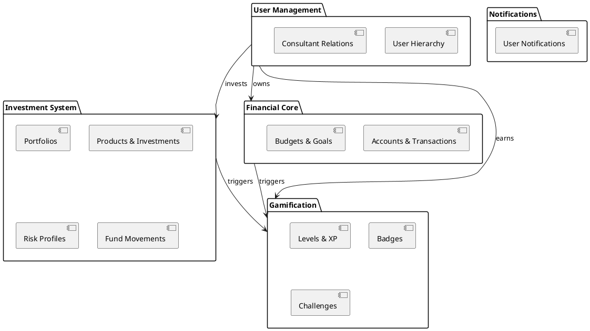
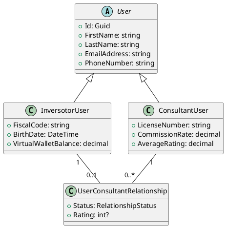
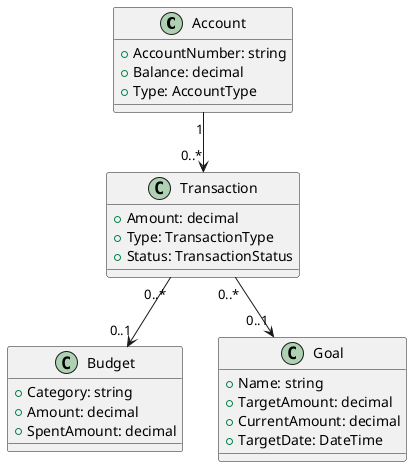
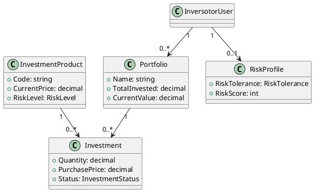
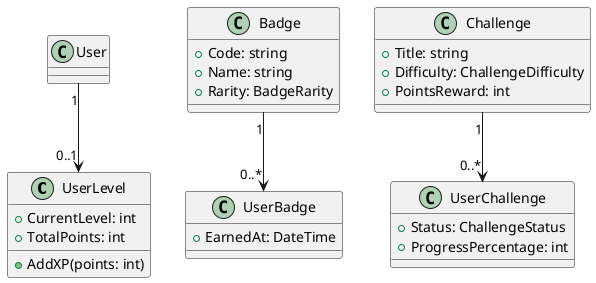

# GoalGrow - Architecture Documentation

## ?? Table of Contents
- [Overview](#overview)
- [Architecture Layers](#architecture-layers)
- [Domain Modules](#domain-modules)
- [Database Contexts](#database-contexts)
- [Design Patterns](#design-patterns)
- [PlantUML Diagrams](#plantuml-diagrams)

---

## ?? Overview

GoalGrow è un'applicazione finanziaria modulare per la gestione di budget, obiettivi, investimenti e gamification.

### Principi Architetturali
- **Domain-Driven Design (DDD)**: Separazione dei domini
- **Clean Architecture**: Dipendenze verso l'interno
- **SOLID Principles**: Codice manutenibile e testabile
- **Modular Monolith**: Moduli separati in un unico database

---

## ??? Architecture Layers

```
???????????????????????????????????????
?         Presentation Layer          ?
?        (API/Web/Desktop)            ?
???????????????????????????????????????
              ?
???????????????????????????????????????
?        Application Layer            ?
?    (Use Cases / Services)           ?
???????????????????????????????????????
              ?
???????????????????????????????????????
?          Domain Layer               ?
?  (Entities / Value Objects)         ?
?     GoalGrow.Entity                 ?
???????????????????????????????????????
              ?
???????????????????????????????????????
?     Infrastructure Layer            ?
?  (Data Access / External Services)  ?
?       GoalGrow.Data                 ?
???????????????????????????????????????
```

---

## ?? Domain Modules

### 1. **User Management Module**
Gestione utenti e autenticazione.

**Entities:**
- `User` (abstract base class)
- `InversotorUser` (investor user)
- `ConsultantUser` (financial advisor)
- `UserConsultantRelationship`

**Namespace:** `GoalGrow.Entity.Models`

---

### 2. **Financial Core Module**
Gestione conti, transazioni, budget e obiettivi.

**Entities:**
- `Account` - Conti bancari
- `Transaction` - Transazioni
- `RecurringTransaction` - Transazioni ricorrenti
- `Payee` - Beneficiari
- `Budget` - Budget per categoria
- `Goal` - Obiettivi finanziari

**DbContext:** `FinancialDbContext`  
**Namespace:** `GoalGrow.Entity.Models`

---

### 3. **Investment System Module**
Sistema di investimenti e consulenza finanziaria.

**Entities:**
- `Portfolio` - Portafoglio investimenti
- `Investment` - Investimento singolo
- `InvestmentProduct` - Prodotto finanziario
- `CompanyAccount` - Conto aziendale
- `FundMovement` - Movimenti fondi
- `RiskProfile` - Profilo rischio (MIFID II)
- `CommissionTransaction` - Commissioni consulente
- `PortfolioSnapshot` - Snapshot performance

**DbContext:** `InvestmentDbContext`  
**Namespace:** `GoalGrow.Entity.Models`

---

### 4. **Gamification Module**
Sistema di gamification con badge, sfide e livelli.

**Entities:**
- `Badge` - Badge disponibili
- `UserBadge` - Badge guadagnati
- `Challenge` - Sfide
- `UserChallenge` - Sfide accettate
- `UserLevel` - Livelli ed XP

**DbContext:** `GamificationDbContext`  
**Namespace:** `GoalGrow.Entity.Models`

---

### 5. **Notification Module**
Sistema di notifiche utente.

**Entities:**
- `Notification` - Notifiche

**Namespace:** `GoalGrow.Entity.Models`

---

## ??? Database Contexts

### Main Context
```csharp
GoalGrowDbContext : DbContext
```
- Context principale che include tutti i moduli
- Usato per operazioni cross-module
- Migration principale

### Module Contexts (Optional)
```csharp
FinancialDbContext : DbContext       // Financial module
InvestmentDbContext : DbContext      // Investment module
GamificationDbContext : DbContext    // Gamification module
```
- Contexts separati per bounded contexts
- Facilitano testing e separazione logica
- Condividono lo stesso database fisico

---

## ?? Design Patterns

### 1. **Value Objects**
Oggetti immutabili che rappresentano concetti del dominio.

**Implementati:**
- `Money` - Valore monetario con valuta
- `DateRange` - Periodo temporale
- `Rating` - Valutazione con recensione
- `ContactInfo` - Informazioni di contatto

**Location:** `GoalGrow.Entity.ValueObjects`

**Example:**
```csharp
var price = new Money(100.50m, "EUR");
var total = price.Add(new Money(50m, "EUR"));
```

---

### 2. **Base Classes**
Classi base per ridurre duplicazione.

**Implementate:**
- `AuditableEntity` - CreatedAt, UpdatedAt
- `FullAuditableEntity` - Soft delete support

**Location:** `GoalGrow.Entity.Common`

**Example:**
```csharp
public class Goal : AuditableEntity
{
    // Id, CreatedAt, UpdatedAt already included
    public string Name { get; set; }
    // ...
}
```

---

### 3. **Table Per Hierarchy (TPH)**
Inheritance mapping per User hierarchy.

```csharp
User (abstract)
??? InversotorUser
??? ConsultantUser
```

**Configuration:**
```csharp
modelBuilder.Entity<User>()
    .HasDiscriminator<UserType>("UserType")
    .HasValue<User>(UserType.AdminUser)
    .HasValue<InversotorUser>(UserType.InvestorUser)
    .HasValue<ConsultantUser>(UserType.ConsultantUser);
```

---

### 4. **Repository Pattern**
*(To be implemented)*

Planned structure:
```csharp
IRepository<T>
IFinancialRepository
IInvestmentRepository
IGamificationRepository
```

---

## ?? PlantUML Diagrams

### System Overview



### User Management Module



### Financial Core Module



### Investment System Module



### Gamification Module



---

## ?? Configuration Organization

```
GoalGrow.Data/
??? Configurations/
    ??? User/
    ?   ??? UserConfiguration.cs
    ?   ??? InversotorUserConfiguration.cs
    ?   ??? ConsultantUserConfiguration.cs
    ??? Financial/
    ?   ??? AccountConfiguration.cs
    ?   ??? TransactionConfiguration.cs
    ?   ??? BudgetConfiguration.cs
    ?   ??? GoalConfiguration.cs
    ??? Investment/
    ?   ??? PortfolioConfiguration.cs
    ?   ??? InvestmentConfiguration.cs
    ?   ??? RiskProfileConfiguration.cs
    ?   ??? FundMovementConfiguration.cs
    ??? Gamification/
        ??? BadgeConfiguration.cs
        ??? ChallengeConfiguration.cs
        ??? UserLevelConfiguration.cs
```

---

## ?? Further Reading

- [Domain-Driven Design](https://martinfowler.com/bliki/DomainDrivenDesign.html)
- [Clean Architecture](https://blog.cleancoder.com/uncle-bob/2012/08/13/the-clean-architecture.html)
- [EF Core Configuration](https://docs.microsoft.com/en-us/ef/core/modeling/)
- [Value Objects](https://martinfowler.com/bliki/ValueObject.html)

---

## ?? Notes

- Tutti i DbContext condividono lo stesso database fisico
- Le migration vengono gestite tramite `GoalGrowDbContext` principale
- I moduli possono essere estratti in microservizi in futuro
- Value Objects semplificano la logica di dominio

